# GPT3.5代码能力：以爬取华为安全中心信息为例

## 前言
最近有个需求爬取华为安全中心的ips规则信息，我就想让GPT来写这种小脚本，节省自己时间。实际实践之后发现GPT写的代码可用性很高，在给他足够的提示之后GPT给出的代码可以直接运行。

## 脚本编写
### html页面下载
华为安全中心链接如下：

https://isecurity.huawei.com/sec/web/ipsVulnerability.do

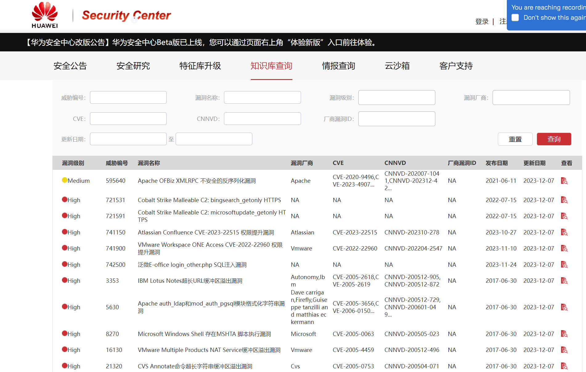

数据当前共有29659条，需要进行翻页下载


选择每页数据为50条，点击查看第二页的数据，请求头和请求data分别如下

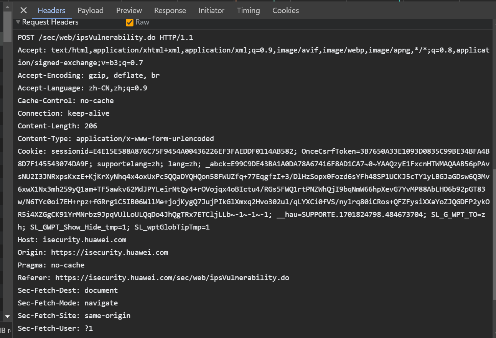

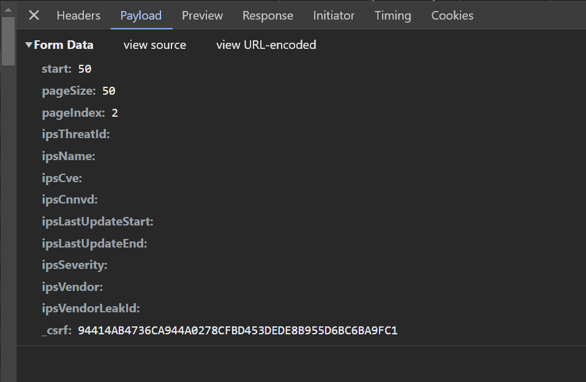

直接复制post的header给gpt让生成脚本
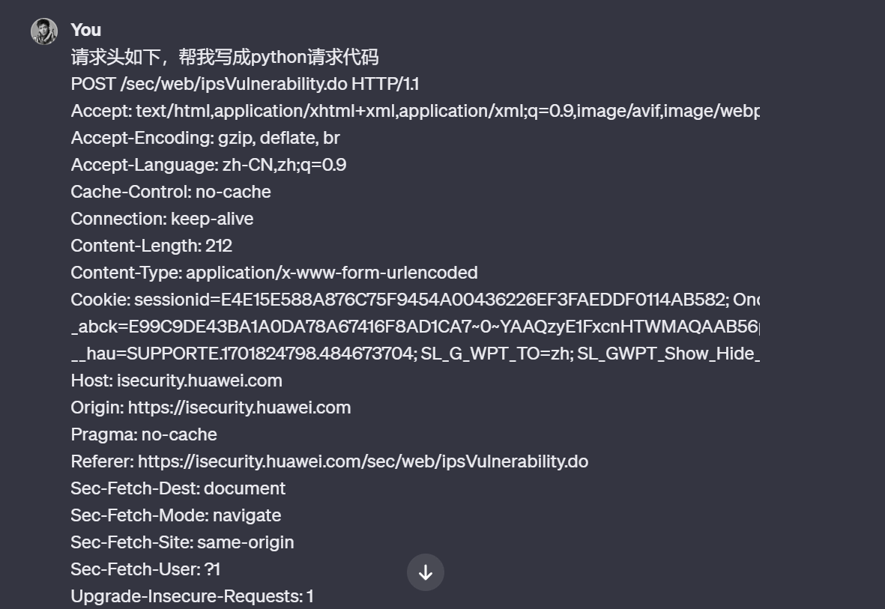

回复的代码没用问题，节省很多时间
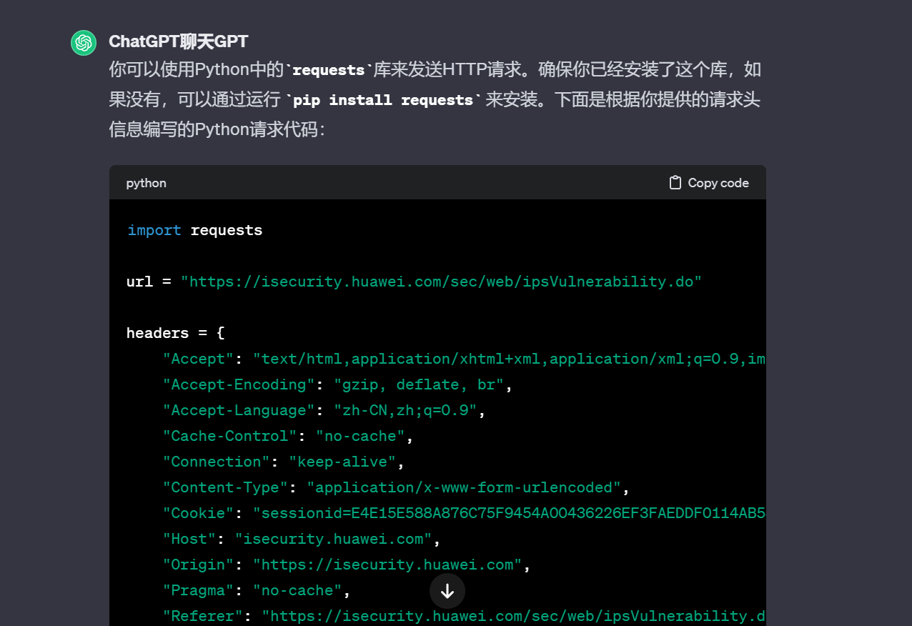

```python
import requests

url = "https://isecurity.huawei.com/sec/web/ipsVulnerability.do"

headers = {
    "Accept": "text/html,application/xhtml+xml,application/xml;q=0.9,image/avif,image/webp,image/apng,*/*;q=0.8,application/signed-exchange;v=b3;q=0.7",
    "Accept-Encoding": "gzip, deflate, br",
    "Accept-Language": "zh-CN,zh;q=0.9",
    "Cache-Control": "no-cache",
    "Connection": "keep-alive",
    "Content-Type": "application/x-www-form-urlencoded",
    "Cookie": "sessionid=E4E15E588A876C75F9454A00436226EF3FAEDDF0114AB582; OnceCsrfToken=3B7650A33E1093D0835C99BE34BFA4B8D7F145543074DA9F; supportelang=zh; lang=zh; _abck=E99C9DE43BA1A0DA78A67416F8AD1CA7~0~YAAQzyE1FxcnHTWMAQAAB56pPAvsNU2I3JNRxpsKxzE+KjKrXyNhq4x4oxUxPc5QQaDYQHQon58FWUZfq+77EqgfzI+3/DlHzSopx0Fozd6sYFh48SP1UCKJ5cTY1yLBGJaGDsw6Q3Mv6xwX1Nx3mh259yQ1am+TF5awkv62MdJPYLeirNtQy4+rOVojqx4oBIctu4/RGs5FWQ1rtPNZWhQjI9bqNmW66hpXevG7YvMP88AbLHO6b92pGT83w/N6TYc0oi7EH+rpz+fGRrg1C5IB06WllMe+jojKygQ7JujPIkGlXmxq2Hvo302ul/qLYXCi0fVS/nylrq80iCRos+QFZFysiXXaYoZJQGDFP2ykOR5i4XZGgCK91YrMNrbz9JpqVUlLoULQqDo4JhQgTRx7ETCljLLb~-1~-1~-1; __hau=SUPPORTE.1701824798.484673704; SL_G_WPT_TO=zh; SL_GWPT_Show_Hide_tmp=1; SL_wptGlobTipTmp=1",
    "Host": "isecurity.huawei.com",
    "Origin": "https://isecurity.huawei.com",
    "Pragma": "no-cache",
    "Referer": "https://isecurity.huawei.com/sec/web/ipsVulnerability.do",
    "Sec-Fetch-Dest": "document",
    "Sec-Fetch-Mode": "navigate",
    "Sec-Fetch-Site": "same-origin",
    "Sec-Fetch-User": "?1",
    "Upgrade-Insecure-Requests": "1",
    "User-Agent": "Mozilla/5.0 (Windows NT 10.0; Win64; x64) AppleWebKit/537.36 (KHTML, like Gecko) Chrome/119.0.0.0 Safari/537.36",
    "sec-ch-ua": '"Google Chrome";v="119", "Chromium";v="119", "Not?A_Brand";v="24"',
    "sec-ch-ua-mobile": "?0",
    "sec-ch-ua-platform": '"Windows"',
}

# 构造POST请求的数据
data = {
    # 在这里添加你的POST请求数据
}

response = requests.post(url, headers=headers, data=data)

# 打印响应内容
print(response.text)

```
继续提供data数据让gpt修改脚本


现在脚本已经是完全可用的了,可以爬取一个页面
```python
import requests

url = "https://isecurity.huawei.com/sec/web/ipsVulnerability.do"

headers = {
    "Accept": "text/html,application/xhtml+xml,application/xml;q=0.9,image/avif,image/webp,image/apng,*/*;q=0.8,application/signed-exchange;v=b3;q=0.7",
    "Accept-Encoding": "gzip, deflate, br",
    "Accept-Language": "zh-CN,zh;q=0.9",
    "Cache-Control": "no-cache",
    "Connection": "keep-alive",
    "Content-Type": "application/x-www-form-urlencoded",
    "Cookie": "sessionid=E4E15E588A876C75F9454A00436226EF3FAEDDF0114AB582; OnceCsrfToken=3B7650A33E1093D0835C99BE34BFA4B8D7F145543074DA9F; supportelang=zh; lang=zh; _abck=E99C9DE43BA1A0DA78A67416F8AD1CA7~0~YAAQzyE1FxcnHTWMAQAAB56pPAvsNU2I3JNRxpsKxzE+KjKrXyNhq4x4oxUxPc5QQaDYQHQon58FWUZfq+77EqgfzI+3/DlHzSopx0Fozd6sYFh48SP1UCKJ5cTY1yLBGJaGDsw6Q3Mv6xwX1Nx3mh259yQ1am+TF5awkv62MdJPYLeirNtQy4+rOVojqx4oBIctu4/RGs5FWQ1rtPNZWhQjI9bqNmW66hpXevG7YvMP88AbLHO6b92pGT83w/N6TYc0oi7EH+rpz+fGRrg1C5IB06WllMe+jojKygQ7JujPIkGlXmxq2Hvo302ul/qLYXCi0fVS/nylrq80iCRos+QFZFysiXXaYoZJQGDFP2ykOR5i4XZGgCK91YrMNrbz9JpqVUlLoULQqDo4JhQgTRx7ETCljLLb~-1~-1~-1; __hau=SUPPORTE.1701824798.484673704; SL_G_WPT_TO=zh; SL_GWPT_Show_Hide_tmp=1; SL_wptGlobTipTmp=1",
    "Host": "isecurity.huawei.com",
    "Origin": "https://isecurity.huawei.com",
    "Pragma": "no-cache",
    "Referer": "https://isecurity.huawei.com/sec/web/ipsVulnerability.do",
    "Sec-Fetch-Dest": "document",
    "Sec-Fetch-Mode": "navigate",
    "Sec-Fetch-Site": "same-origin",
    "Sec-Fetch-User": "?1",
    "Upgrade-Insecure-Requests": "1",
    "User-Agent": "Mozilla/5.0 (Windows NT 10.0; Win64; x64) AppleWebKit/537.36 (KHTML, like Gecko) Chrome/119.0.0.0 Safari/537.36",
    "sec-ch-ua": '"Google Chrome";v="119", "Chromium";v="119", "Not?A_Brand";v="24"',
    "sec-ch-ua-mobile": "?0",
    "sec-ch-ua-platform": '"Windows"',
}

# 构造POST请求的数据
data = {
    "start": "29655",
    "pageSize": "15",
    "pageIndex": "1978",
    "ipsThreatId": "",
    "ipsName": "",
    "ipsCve": "",
    "ipsCnnvd": "",
    "ipsLastUpdateStart": "",
    "ipsLastUpdateEnd": "",
    "ipsSeverity": "",
    "ipsVendor": "",
    "ipsVendorLeakId": "",
    "_csrf": "94414AB4736CA944A0278CFBD453DEDE8B955D6BC6BA9FC1",
}

response = requests.post(url, headers=headers, data=data)

# 打印响应内容
print(response.text)

```

这时我们继续访问下第四页的数据，看看payload如何变化
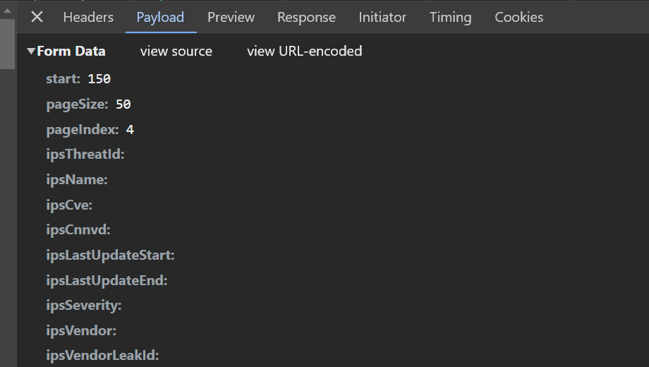

我们可以看到start，pagesize,pageindex直接存在的关系是： start=pagesize*(pageindex-1)，继续把这个关系告诉gpt（这里我写错了一些。。不过GPT还是理解了我的意思）

```python
import requests

def calculate_start(pageindex):
    return (pageindex - 1) * 50  # Assuming pagesize is always 50

url = "https://isecurity.huawei.com/sec/web/ipsVulnerability.do"

headers = {
    "Accept": "text/html,application/xhtml+xml,application/xml;q=0.9,image/avif,image/webp,image/apng,*/*;q=0.8,application/signed-exchange;v=b3;q=0.7",
    "Accept-Encoding": "gzip, deflate, br",
    "Accept-Language": "zh-CN,zh;q=0.9",
    "Cache-Control": "no-cache",
    "Connection": "keep-alive",
    "Content-Type": "application/x-www-form-urlencoded",
    "Cookie": "sessionid=E4E15E588A876C75F9454A00436226EF3FAEDDF0114AB582; OnceCsrfToken=3B7650A33E1093D0835C99BE34BFA4B8D7F145543074DA9F; supportelang=zh; lang=zh; _abck=E99C9DE43BA1A0DA78A67416F8AD1CA7~0~YAAQzyE1FxcnHTWMAQAAB56pPAvsNU2I3JNRxpsKxzE+KjKrXyNhq4x4oxUxPc5QQaDYQHQon58FWUZfq+77EqgfzI+3/DlHzSopx0Fozd6sYFh48SP1UCKJ5cTY1yLBGJaGDsw6Q3Mv6xwX1Nx3mh259yQ1am+TF5awkv62MdJPYLeirNtQy4+rOVojqx4oBIctu4/RGs5FWQ1rtPNZWhQjI9bqNmW66hpXevG7YvMP88AbLHO6b92pGT83w/N6TYc0oi7EH+rpz+fGRrg1C5IB06WllMe+jojKygQ7JujPIkGlXmxq2Hvo302ul/qLYXCi0fVS/nylrq80iCRos+QFZFysiXXaYoZJQGDFP2ykOR5i4XZGgCK91YrMNrbz9JpqVUlLoULQqDo4JhQgTRx7ETCljLLb~-1~-1~-1; __hau=SUPPORTE.1701824798.484673704; SL_G_WPT_TO=zh; SL_GWPT_Show_Hide_tmp=1; SL_wptGlobTipTmp=1",
    "Host": "isecurity.huawei.com",
    "Origin": "https://isecurity.huawei.com",
    "Pragma": "no-cache",
    "Referer": "https://isecurity.huawei.com/sec/web/ipsVulnerability.do",
    "Sec-Fetch-Dest": "document",
    "Sec-Fetch-Mode": "navigate",
    "Sec-Fetch-Site": "same-origin",
    "Sec-Fetch-User": "?1",
    "Upgrade-Insecure-Requests": "1",
    "User-Agent": "Mozilla/5.0 (Windows NT 10.0; Win64; x64) AppleWebKit/537.36 (KHTML, like Gecko) Chrome/119.0.0.0 Safari/537.36",
    "sec-ch-ua": '"Google Chrome";v="119", "Chromium";v="119", "Not?A_Brand";v="24"',
    "sec-ch-ua-mobile": "?0",
    "sec-ch-ua-platform": '"Windows"',
}

# 构造POST请求的数据
for pageindex in range(2, 595):  # Assuming pageindex maximum value is 594
    data = {
        "start": str(calculate_start(pageindex)),
        "pageSize": "50",
        "pageIndex": str(pageindex),
        "ipsThreatId": "",
        "ipsName": "",
        "ipsCve": "",
        "ipsCnnvd": "",
        "ipsLastUpdateStart": "",
        "ipsLastUpdateEnd": "",
        "ipsSeverity": "",
        "ipsVendor": "",
        "ipsVendorLeakId": "",
        "_csrf": "94414AB4736CA944A0278CFBD453DEDE8B955D6BC6BA9FC1",
    }

    response = requests.post(url, headers=headers, data=data)

    # 打印响应内容
    print(f"Page {pageindex} Response:")
    print(response.text)

```
最后我告诉GPT需要把这些html保存到指定目录


```python
import os
import requests

def calculate_start(pageindex):
    return (pageindex - 1) * 50

def save_response_to_file(pageindex, response_text):
    directory = "data"
    if not os.path.exists(directory):
        os.makedirs(directory)
    
    filename = os.path.join(directory, f"{pageindex}.html")

    with open(filename, "w", encoding="utf-8") as file:
        file.write(response_text)

url = "https://isecurity.huawei.com/sec/web/ipsVulnerability.do"

headers = {
    # 请将你的请求头信息添加到这里
}

for pageindex in range(2, 595):
    data = {
        "start": str(calculate_start(pageindex)),
        "pageSize": "50",
        "pageIndex": str(pageindex),
        "ipsThreatId": "",
        "ipsName": "",
        "ipsCve": "",
        "ipsCnnvd": "",
        "ipsLastUpdateStart": "",
        "ipsLastUpdateEnd": "",
        "ipsSeverity": "",
        "ipsVendor": "",
        "ipsVendorLeakId": "",
        "_csrf": "94414AB4736CA944A0278CFBD453DEDE8B955D6BC6BA9FC1",
    }

    response = requests.post(url, headers=headers, data=data)

    # 打印响应内容
    print(f"Page {pageindex} Response:")
    print(response.text)

    # 将响应写入文件
    save_response_to_file(pageindex, response.text)
```
直接运行代码，一次成功，生成html文件后可以在浏览器渲染下，看看是否爬到了我们要的数据
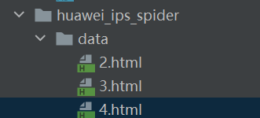

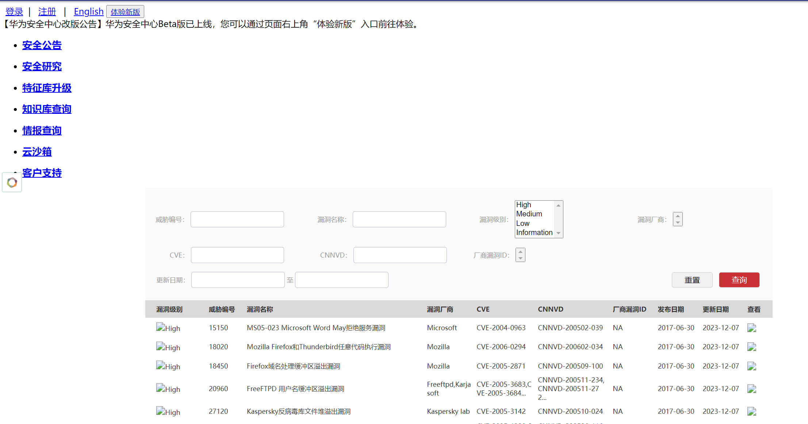

### html页面解析
查看下载的html页面，发现我们要的数据在tbody中，我们告诉GPT标签的依赖关系，让GPT编写脚本提取数据
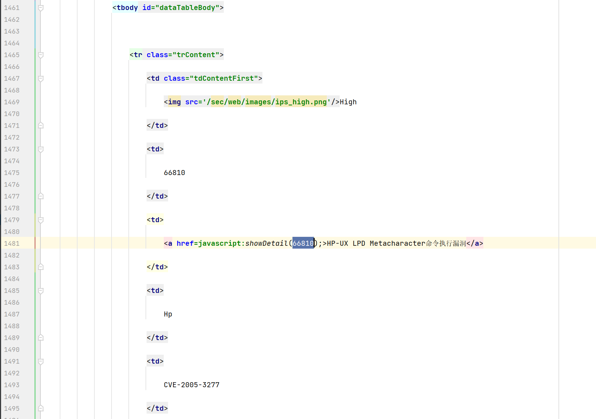


```python
from bs4 import BeautifulSoup

# 假设html_content是包含你的HTML的字符串
html_content = """
<html>
  <body>
    <table>
      <tbody id="dataTableBody">
        <tr class="trContent">
          <!-- Your content here -->
        </tr>
        <!-- Other rows may follow -->
      </tbody>
    </table>
  </body>
</html>
"""

# 使用BeautifulSoup解析HTML
soup = BeautifulSoup(html_content, 'html.parser')

# 选择tbody元素，id为dataTableBody
tbody_element = soup.find('tbody', id='dataTableBody')

# 在tbody元素中选择class为trContent的tr元素
tr_element = tbody_element.find('tr', class_='trContent')

# 打印筛选到的内容
print(tr_element)

```
告诉GPT需要从文件中如何HTML


```python
from bs4 import BeautifulSoup

# 读取HTML文件
with open('your_html_file.html', 'r', encoding='utf-8') as file:
    html_content = file.read()

# 使用BeautifulSoup解析HTML
soup = BeautifulSoup(html_content, 'html.parser')

# 选择tbody元素，id为dataTableBody
tbody_element = soup.find('tbody', id='dataTableBody')

# 在tbody元素中选择class为trContent的tr元素
tr_element = tbody_element.find('tr', class_='trContent')

# 打印筛选到的内容
print(tr_element)

```
我们需要获取到的是tbody中的多行数据，继续修改代码


```python
from bs4 import BeautifulSoup

# 读取HTML文件
with open('your_html_file.html', 'r', encoding='utf-8') as file:
    html_content = file.read()

# 使用BeautifulSoup解析HTML
soup = BeautifulSoup(html_content, 'html.parser')

# 选择tbody元素，id为dataTableBody
tbody_element = soup.find('tbody', id='dataTableBody')

# 在tbody元素中选择所有class为trContent的tr元素
tr_elements = tbody_element.find_all('tr', class_='trContent')

# 遍历所有选中的tr元素
for tr_element in tr_elements:
    # 打印或处理每个tr元素的内容
    print(tr_element)

```
继续修改代码获取tbody中多列数据
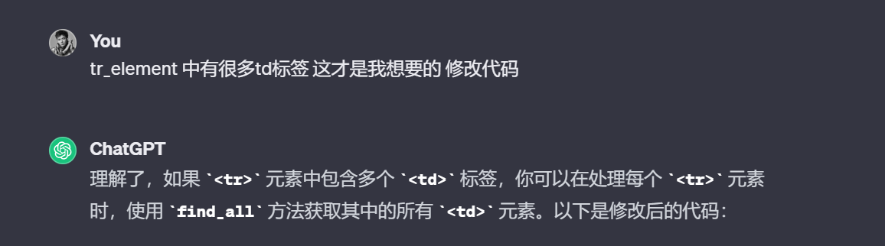
```python
from bs4 import BeautifulSoup

# 读取HTML文件
with open('your_html_file.html', 'r', encoding='utf-8') as file:
    html_content = file.read()

# 使用BeautifulSoup解析HTML
soup = BeautifulSoup(html_content, 'html.parser')

# 选择tbody元素，id为dataTableBody
tbody_element = soup.find('tbody', id='dataTableBody')

# 在tbody元素中选择所有class为trContent的tr元素
tr_elements = tbody_element.find_all('tr', class_='trContent')

# 遍历所有选中的tr元素
for tr_element in tr_elements:
    # 获取当前tr元素下的所有td元素
    td_elements = tr_element.find_all('td')

    # 遍历所有选中的td元素
    for td_element in td_elements:
        # 打印或处理每个td元素的内容
        print(td_element.text)

```
继续告诉GPT我需要把数据保存为Dataframe形式，并最终保存为csv文件
```python
from bs4 import BeautifulSoup
import pandas as pd

def parse_html_table(html_content, tbody_id='dataTableBody', tr_class='trContent'):
    # 使用BeautifulSoup解析HTML
    soup = BeautifulSoup(html_content, 'html.parser')

    # 选择tbody元素，id为dataTableBody
    tbody_element = soup.find('tbody', id=tbody_id)

    # 在tbody元素中选择所有class为trContent的tr元素
    tr_elements = tbody_element.find_all('tr', class_=tr_class)

    # 初始化一个字典，用于存储每一列的值
    data_dict = {f'Column{str(i)}': [] for i in range(1, len(tr_elements[0].find_all('td')) + 1)}

    # 遍历所有选中的tr元素
    for tr_element in tr_elements:
        # 获取当前tr元素下的所有td元素
        td_elements = tr_element.find_all('td')

        # 遍历所有选中的td元素，将值添加到对应列
        for i, td_element in enumerate(td_elements):
            data_dict[f'Column{str(i+1)}'].append(td_element.text.strip())

    # 使用字典创建数据框
    df = pd.DataFrame(data_dict)

    return df

# 读取HTML文件
with open('your_html_file.html', 'r', encoding='utf-8') as file:
    html_content = file.read()

# 使用封装的函数
result_df = parse_html_table(html_content)

# 打印数据框
print(result_df)

```
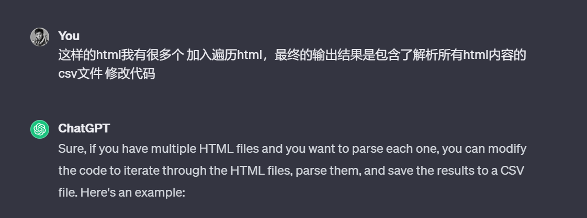
告诉GPT遍历多个HTML文件，输出最终的整合结果，最总的输出结果堪称完美，我们只需要替换HTML文件夹路径就可以得到整合后的数据
```python
from bs4 import BeautifulSoup
import pandas as pd
import os

def parse_html_table(html_content, tbody_id='dataTableBody', tr_class='trContent'):
    # 使用BeautifulSoup解析HTML
    soup = BeautifulSoup(html_content, 'html.parser')

    # 选择tbody元素，id为dataTableBody
    tbody_element = soup.find('tbody', id=tbody_id)

    # 在tbody元素中选择所有class为trContent的tr元素
    tr_elements = tbody_element.find_all('tr', class_=tr_class)

    # 初始化一个字典，用于存储每一列的值
    data_dict = {f'Column{str(i)}': [] for i in range(1, len(tr_elements[0].find_all('td')) + 1)}

    # 遍历所有选中的tr元素
    for tr_element in tr_elements:
        # 获取当前tr元素下的所有td元素
        td_elements = tr_element.find_all('td')

        # 遍历所有选中的td元素，将值添加到对应列
        for i, td_element in enumerate(td_elements):
            data_dict[f'Column{str(i+1)}'].append(td_element.text.strip())

    # 使用字典创建数据框
    df = pd.DataFrame(data_dict)

    return df

# 文件夹路径，包含所有HTML文件
html_folder_path = '/path/to/your/html/files'

# 存储所有数据框的列表
dfs_list = []

# 遍历文件夹中的HTML文件
for filename in os.listdir(html_folder_path):
    if filename.endswith(".html"):
        file_path = os.path.join(html_folder_path, filename)
        
        # 读取HTML文件
        with open(file_path, 'r', encoding='utf-8') as file:
            html_content = file.read()

        # 使用封装的函数
        result_df = parse_html_table(html_content)

        # 将数据框添加到列表
        dfs_list.append(result_df)

# 合并所有数据框
final_df = pd.concat(dfs_list, ignore_index=True)

# 保存为CSV文件
final_df.to_csv('output.csv', index=False)

```

展示下最终的爬取结果，29659条数据完全搞定！这生成的代码看上去比我自己写的好，至少我不会写这样详细的注释。
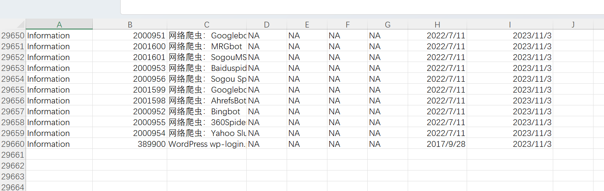
